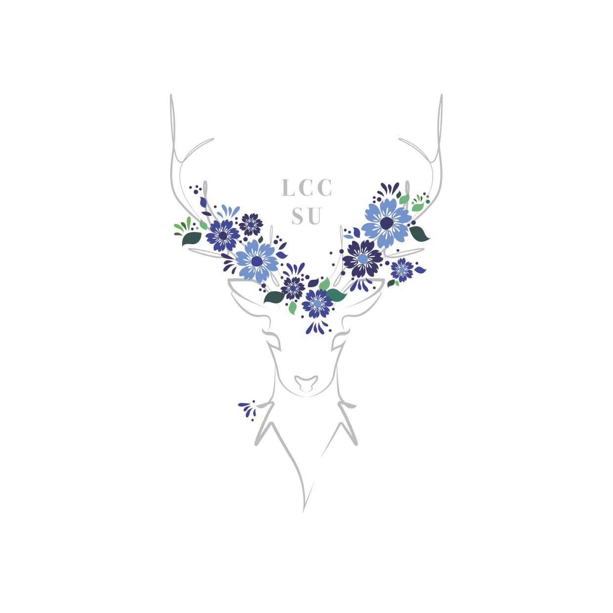

>  style="width:4.00686in;height:3.61435in" />**Form** **for**
> **creation** **of** **a** **new** **Society** **or** **Sports**
> **Club** **affiliated** **with** **the**
>
> **Lucy** **Cavendish** **College** **JCR** **&** **MCR** **\[Updated**
> **March** **2023\]**
>
> *Constitution* *to* *be* *completed* *by* *new* *club’s* *proposer*
> *and* *seconder*
>
> **1.** **The** **Club:**
>
> **1.1.** The name of the club is the Lucy Cavendish College Science
> Society
>
> **1.2.** The club shall be referred to as the LCC Science Society
> throughout this document.
>
> **1.3.** The LCC Science Society may also be initialised as LCCSC in
> communications.
>
> **1.4.** The constitution for this club shall be submitted to the Lucy
> Cavendish College JCR Committee via <u>either</u> the Sports and
> Societies Officer, *or* the President for approval in December 2023
> and at intervals of no more than 5 academic years thereafter, starting
> from October, 2024.
>
> **2.** **Aims** **and** **Objectives** **of** **Club:**
>
> **2.1.** The LCC Science Society aims to promote scientific excellence
> by organising seminars, talks, study sessions, and providing resources
> to enhance the scientific knowledge and skills of our members.
>
> **2.2.** To encourage cross-disciplinary interactions among science
> students through events and projects that bridge the gap between
> various scientific disciplines.
>
> **2.3.** To work with the Lucy Cavendish College Life Science
> Community to arrange and promote events.
>
> **2.4.** To provide social opportunities for its members.
>
> **3.** **Regulations** **for** **Membership** **Eligibility:**
>
> **3.1.** Membership is available to all members of the Lucy Cavendish
> College JCR & MCR.

Form for new Society or Sports Club’s affiliation with the Lucy
Cavendish College JCR 1 & MCR \[updated March 2023\]

> **3.2.** The committee of the LCC Science Society may admit Staff,
> Fellows or Post-Doctoral Members of Lucy Cavendish College following
> majority approval of the committee.
>
> **3.3.** The committee of the LCC Science Society may admit Honorary
> Membership upon any Cambridge University student following majority
> approval of the LCC Science Society committee, and approval of the
> Lucy Cavendish College JCR.
>
> **3.4.** Present or former University of Cambridge students who give a
> talk or present their research will be automatically granted Honorary
> Membership of the LCC Science Society.
>
> **4.** **Election** **of** **Committee** **and** **Officers:**
>
> **4.1** There shall be an annual election of Officers for the LCC
> Science Society. **4.2** The election shall be organised by the
> current President of LCC Science
>
> Society, unless the LCC Science Society Committee decides otherwise,
> in which case another member of the LCC Science Society shall be
> appointed, or a member of the Lucy Cavendish College JCR requested to
> oversee the election.
>
> **4.3** The term of Office of LCC Science Society Officers shall be
> one year, from the start of Michaelmas Term.
>
> **4.4** Elections shall take place annually at an **Annual**
> **General** **Meeting** **\[AGM\]** of the club, which will be held
> within Lucy Cavendish College during the Lent Term. Voting should take
> place in a manner which assures confidence of the members voting.
>
> **4.5** All full members of LCC Science Society are entitled to a
> single vote for each position being contested within the election.
>
> **4.6** Voting is conducted via Single Transferrable Vote
>
> **4.7** In the event of a tied vote, the current LCC Science Society
> President shall have the casting vote.
>
> **4.8** Results of the election shall be recorded for any member of
> the LCC Science Society or Lucy Cavendish College JCR Committee to
> see, and shall be published to the LCC Science Society & JCR not more
> than 1 week after the election.
>
> **4.9** The LCC Science Society Committee shall, at minimum, consist
> of both a President and Treasurer.
>
> **4.10** In the event of an Officer position becoming vacant, an
> **Emergency** **General** **Meeting** **\[EGM**\] may be held
> following one week’s notice of the Emergency General Meeting being
> sent to the members of LCC Science Society.
>
> **4.10.1**Emergency General Meeting’s may be held at any point in the
> year for the election of new Officers.

Form for new Society or Sports Club’s affiliation with the Lucy
Cavendish College JCR 2 & MCR \[updated March 2023\]

> **4.10.2**Officers elected at an Emergency General Meeting’s will only
> be elected to remain in post for the remainder of a vacant positions
> term of office.
>
> **5.** **Election** **of** **Committee** **and** **Officers:**
>
> **5.1** The LCC Science Society Committee shall consist of the
> following positions, whose roles and role descriptions follow below.
> (Positions marked by \[\*\] must be filled in order for the Club to
> remain affiliated to the JCR):
>
> **5.1.1** **<u>President \*</u>**
>
> **1.** Shall report to LCC Science Society Committee
>
> **2.** Shall be responsible for liaison between the Club and the
> College. **3.** Shall be responsible for liaison between the Club and
> the Sports &
>
> Society Officer of the Lucy Cavendish College JCR & MCR **4.** Shall
> oversee the daily running of the club.
>
> **5.** Shall promote the aims and objectives of the club. **6.** Shall
> chair committee meetings of the society.
>
> **7.** Shall organise and oversee the election of new Officers at the
> Annual General Meeting and may also call an Emergency General Meeting
> at any point in the year to fill vacant roles on the Committee.
>
> **8.** Shall be empowered to act without general consultation of the
> LCC Science Society Committee, on behalf of the Club at meetings with
> the College or Lucy Cavendish College JCR Committee, on matters of
> minor, non-contentious, or urgent nature, in line with the aims and
> objectives of the Club. Such actions should be communicated with other
> Officers on the LCC Science Society Committee at the next opportunity.
>
> **9.** Shall have responsibility for training and induction of their
> successor.
>
> **5.1.2** **<u>Treasurer \*</u>**
>
> **1.** Shall report to the LCC Science Society Committee.
>
> **2.** Shall be responsible for all aspects of the Tiddlewinks Club
> finance, and implementation of spending directives given by the Lucy
> Cavendish College JCR and/or the College.
>
> **3.** Shall be responsible for presenting of annual accounts to the
> Treasurer of the Lucy Cavendish College JCR, and make them available
> upon request throughout the year.
>
> **4.** Shall be responsible for presenting budget proposals to the
> Lucy Cavendish College JCR

Form for new Society or Sports Club’s affiliation with the Lucy
Cavendish College JCR 3 & MCR \[updated March 2023\]

> **5.** Shall attend all relevant meetings held between the Club and
> the Lucy Cavendish College JCR or College.
>
> **6.** Shall have responsibility for training and induction of their
> successor.

**<u>It is strongly recommended that societies have further roles on
their</u>** **<u>committee. A Welfare Officer & Events Officer are key
in many societies as are</u>** **<u>the roles below</u>**

> **5.1.3** **<u>\[e.g.\] Secretary</u>** **5.1.4** **<u>\[e.g.\]
> Captain</u>**
>
> **5.1.5** **<u>\[e.g.\] Vice President</u>**
>
> **6.** **Provision** **for** **Making** **Amendments** **to** **the**
> **Constitution:**
>
> **6.1** Amendments to the LCC Science Society constitution may be made
> at any quorate \[attended by at least 65% of club members\] General
> Meeting of the Club, in which at least 80% of votes are in favour of
> the amendment proposed.
>
> **6.2** Proposed amendments should be circulated to the club not less
> than 5 full days before the meeting in a manner that is fair and open.
>
> **6.3** Any amendments to the constitution should be shared in a
> timely manner with the Lucy Cavendish College JCR Committee
>
> **7.** **Dissolution**
>
> **7.1.** The Society may be dissolved at a General Meeting provided
> that at least Twenty-one days written notice of the intention to
> dissolve the Society has been given to the members. At least two
> thirds of those present and voting at the General Meeting must vote in
> favour of the motion for Dissolution for it to be effective and must
> have the approval of the JCR President.
>
> **7.2.** Any motion for Dissolution of the Society shall provide that
> assets remaining after all liabilities have been met shall be returned
> to Lucy Cavendish College JCR.
>
> **<u>Useful Information for Clubs and Societies in JCR
> Constitution</u>**

Section 5.3: Clubs and Societies

> a\. The JCR Committee, in collaboration with the MCR Committee, shall
> be responsible for the fair allocation of resources to the constituent
> Clubs and Societies.

Form for new Society or Sports Club’s affiliation with the Lucy
Cavendish College JCR 4 & MCR \[updated March 2023\]

> b\. Each constituent Club and Society shall elect annually by ballot
> (which shall mean either an electronic vote of all club members or a
> show of hands at a general meeting) from among its members an Officer
> who shall be responsible to the JCR Committee for the finances of the
> Club or Society.

Section 10: TREASURER

10.1. The Treasurer shall be responsible to the JCR for the keeping of
accounts and shall exercise supervision over all JCR finances, subject
to decisions of the Committee and Open Meeting. The Treasurer will
liaise with the College Finance Office who administer the bank account
and prepare draft accounts on behalf of the JCR.

10.2. Any Executive Officer shall have the power to authorise any
expenditure up to £100.00

10.3. Any Executive Officer shall have the power to authorise any
expenditure up to £100.00

10.4. The JCR Committee shall have the power to authorise expenditure up
to and including £750 in a quorate Committee Meeting by simple majority.

10.5. The JCR Membership shall have the power to authorise any
expenditure, not exceeding their current assets, in a quorate Open
Meeting or through online voting between Open Meetings by simple
majority

10.6. The Treasurer shall present approved (and where advised by the
College Bursar independently examined or audited) accounts at each
Annual General Meeting

10.7. Any expenditure agreed during an Open meeting in any given
academic year must be spent within the said academic year and will not
be carried over to the following academic year (unless it is passed in
relation to Freshers events the following year).

**Section** **11:** **CLUBS** **&** **SOCIETIES**

11.1. Any Lucy Cavendish college students’ club or society made up of
undergraduate students shall be recognised by the JCR Committee,
provided the President of said club or society provides a constitution
to be evaluated by the JCR that includes the following:

> \`i. the name of the club or society ii.the aims and objectives of the
> club
>
> iii\. regulations relating to membership eligibility
>
> iv\. provision for the election of a Committee or Officers v. a budget

This will ensure that the proposed club or society aligns with the
broader goals of the JCR.

Form for new Society or Sports Club’s affiliation with the Lucy
Cavendish College JCR 5 & MCR \[updated March 2023\]

11.2. Any club or society that is recognised will be eligible to receive
money from the JCR funds.

11.3. The recognition of a club or society shall be withdrawn by the JCR
Committee if evidence is received of its contravening its constitution,
or the wider aims of the College or JCR.

11.4. The JCR Committee shall be responsible for the allocation of the
JCR funds to college clubs and societies in accordance with section 10
of this constitution.

11.5. Funds shall be allocated according to budget proposals presented
by a club or society and approved by the JCR Committee, or by a
resolution of the JCR Committee.

**S.2.2.4** **SPORTS** **&** **SOCIEITES** **OFFICER**

1\. Shall report to the President and JCR Committee.

2\. Shall aid and assist societies with advertising and general society
management.

3\. Shall promote sports amongst membership.

4\. Shall assist the Entertainment Officers in co-ordinating and aiding
the social events of societies. … ”

**The** **above** **information** **is** **quoted** **from** **the**
**JCR** **Constitution,** **approved** **in** **Oct** **2022.**

Form for new Society or Sports Club’s affiliation with the Lucy
Cavendish College JCR 6 & MCR \[updated March 2023\]
